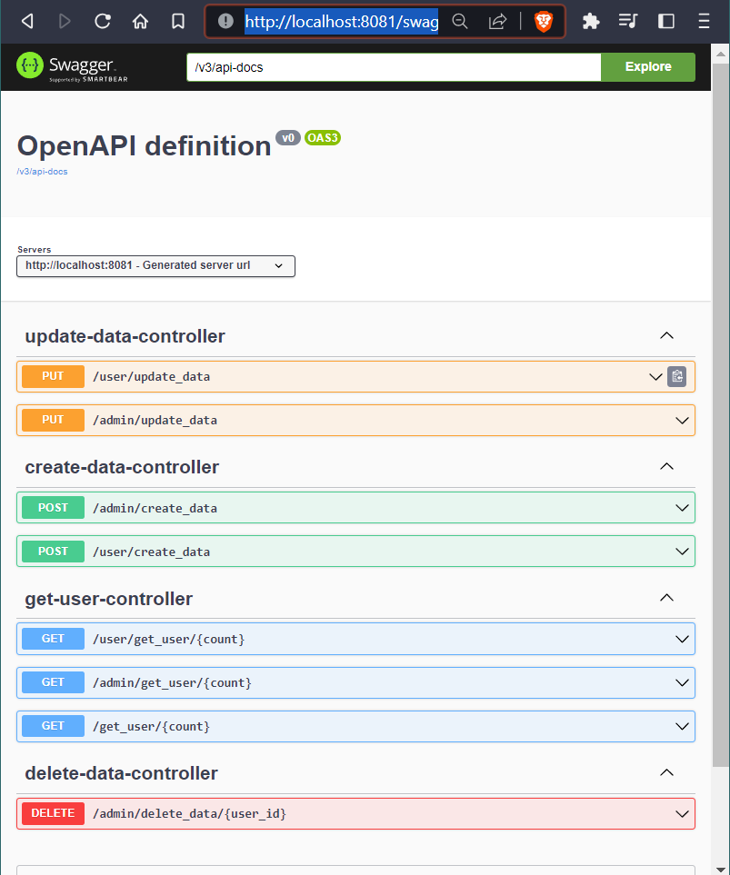

# **Project Name : User Location Problem**

## **Technologies Used**

- [Java](https://www.java.com) - Programming language
- [Spring Boot](https://spring.io/projects/spring-boot) - Framework for creating Spring applications
- [Gradle](https://maven.apache.org) - Build tool and dependency management
- [HSQL](http://hsqldb.org/) - Relational database management system (In-Memory)

## **Features**

- Admin can perform all the CRUD operation
- User can perform only Create and Update operation
- Reader can perform only Read operation

## **Getting Started**

### **Prerequisites**
- Java 8 or higher installed

### **Installation**

1. Clone the repository: `git clone [https://github.com/shirishjaiswal/User-Location.git]`
2. Navigate into the project directory: `cd [..\User Location Problem\user-location\user-location]`
3. Build the project: `mvn clean install`

### **Usage**

1. Run the application: `mvn spring-boot:run`
2. Access the application by running locally.

### **RESTful API server
| METHOD | PATH | DESCRIPTION |
| --------------- | --------------- | --------------- |
| GET | `/user/get_user/{count}` | Getting the count number of Users near to (0,0) as mentioned in Problem statement |
| GET | `/admin/get_user/{count}` | -//- |
| GET | `/get_user/{count}` | -//-|
| POST | `/user/create_data` | To add User Location in the database |
| POST | `/admin/create_data` | -//- |
| PUT | `/user/update_data` | To Update the User Location in Database |
| PUT | `/admin/update_data` | -//- |
| DELETE | `/admin/delete_data/{user_id}` | To Delete the User Data from Database |
## **Documentation**
Run the Project on Local Machine and Hit the Swagger URL

**Swagger Url** : http://localhost:8081/swagger-ui/index.html

